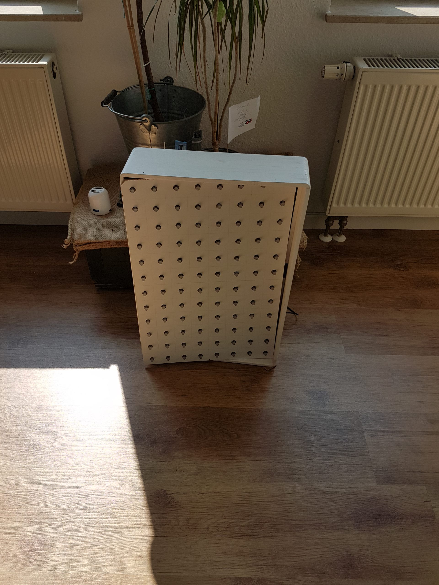
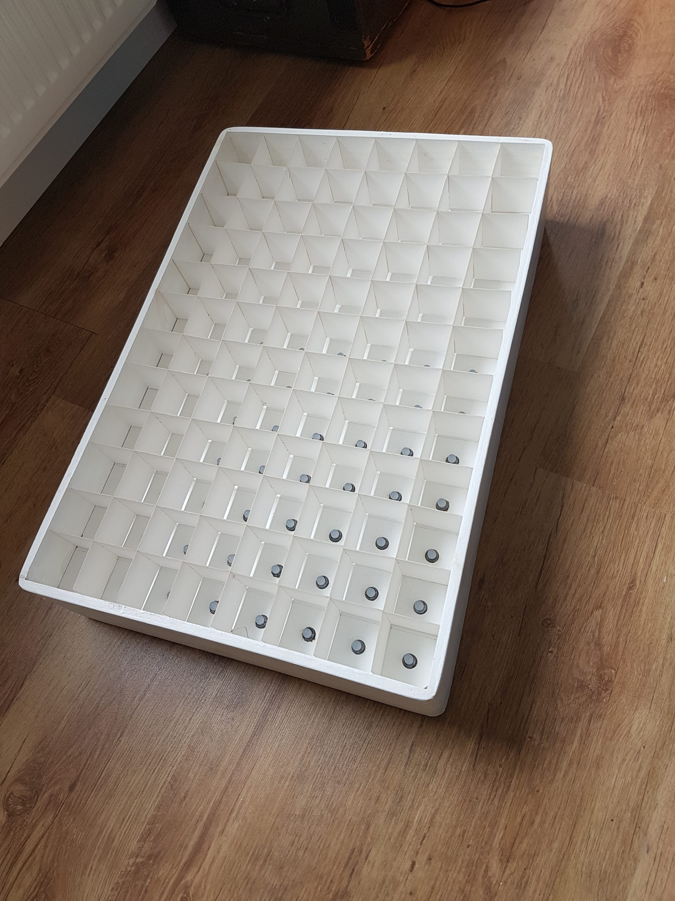
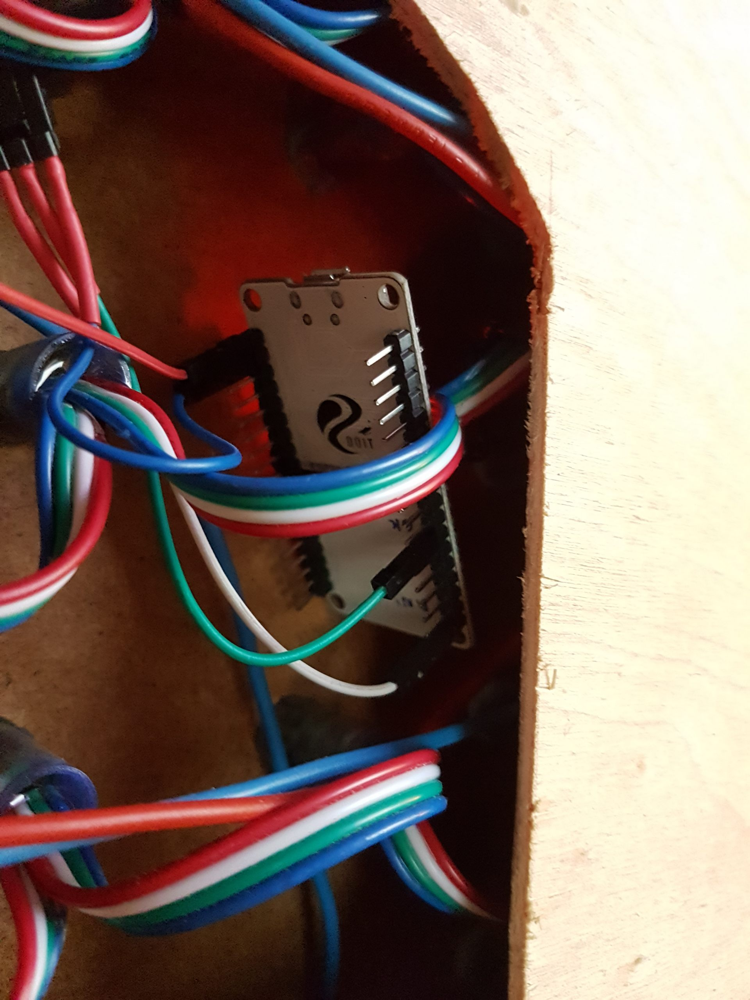
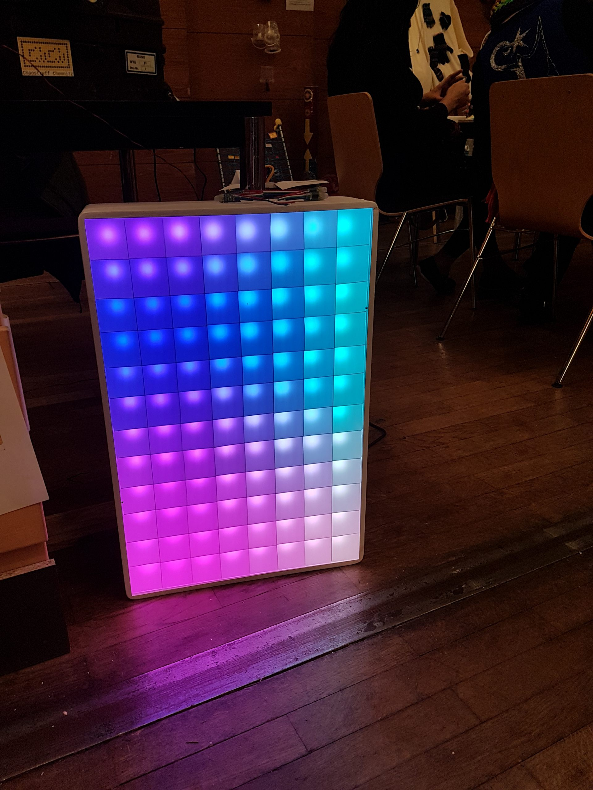

# pixelpanel-TPM2.Net-SPI
ESP32 - SPI-Pixelpanel Ansteuerung. Code läuft mit arduino-Umgebung auf dem ESP32. 
Schaufelt aus dem UDP-Server auf 65506 pixeldaten im Protokoll TPM2.Net via FastPixel auf den SPI-Port 
des ESP32. Dieser loggt sich in ein WLAN ein und empfängt so die Daten.

Zusätzlich ist demnächst Basecamp inkludiert

## Nutzen 
Einfach per Glediator [[http://www.solderlab.de/]] Pixelmatrix einrichten und auf die IP des ESP32 lenken. Port 65506
Protokoll siehe: [[http://www.ledstyles.de/index.php/Attachment/28200-TPM2-Specs-V1-0-2013-ger-pdf/]]
Anzahl der LEDs angeben und der Code hier müsste auch angepasst werden.

Aktuell wird nicht auf TPM2-Pakete geantwortet. Somit lässt sich auch die Matrixgröße nicht mitteilen.

## Bilder einer Matrix, wo es läuft
Diese LED-Matrix wurde mit einer SPI-LED-Kette gebaut.
Zur Ansteuerung ist ein ESP-32 enthalten, der auf 3 Pins SPI ausgibt.
Er wird über die 5V des Gesamtsystems mitversorgt. Darauf befindet sich diese Software.
Die Software ist aber relativ dumm. Sie loggt sich lediglich in ein konfiguriertes WLAN ein und wartet auf Pakete.
Die Pakete muss aber dann eine andere Software bereitstellen. Z.B. [LEDerZaumZeug](https://github.com/Robertofon/LEDerZaumzeug) oder [Glediator](https://oneguyoneblog.com/download/glediator-v2-0-3/).

## Weitere Merkmale
Verwendung von C'ts basecamp [[https://github.com/merlinschumacher/Basecamp]]. Damit sind OTA-Updates
mit der Arduino-IDE möglich und das komfortable Einstellen der SSIDs via WEB. Zunächst wird ein 
unverschlüsseltes Netz esp_* eröffnet. Dort auf 192.168.4.1 gehen und die neue SSID konfigurieren.
Resetieren der Einstellung geht durch 5-maliges Resetieren (jeweils kurz warten, damit er bootet).

## Bauen
Das Bauen sollte ganz leicht sein. Basecamp hat auch nicht so viele Abhänigkeiten. Die 4-5, die es aber hat, muss es genau treffen, sonst gibt es Compile-Fehler. Trick ist, dass man das Repo von Basecamp rekursiv cloned, 
denn dort sind Referenzen auf die externen Bibliotheken drin, die passen (von Revisionen her).

'''
git clone https://github.com/merlinschumacher/Basecamp.git --recurse-submodules
'''

Das im VZ ~/Arduino/libraries 

